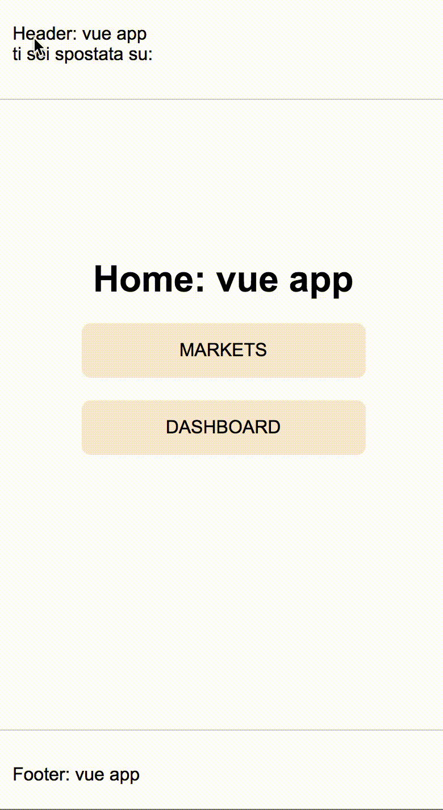

## Single-spa test
[https://single-spa.js.org/](https://single-spa.js.org/) 

The application in composed by 5 different project  
Header, vue 
Footer, vue 
Home, vue 
dashboard, react 
markets, vue  

you can navigate from and to home and markets / dashboard. 
Header is listening on routing event so it change page name  

## Available Scripts

In the project directory, you can run:

`npm run start`

Runs the app in the development mode. 
Open [http://localhost:8080](http://localhost:8080) to view it in the browser.

The page will reload if you make edits. 

### next steps:
- add 
